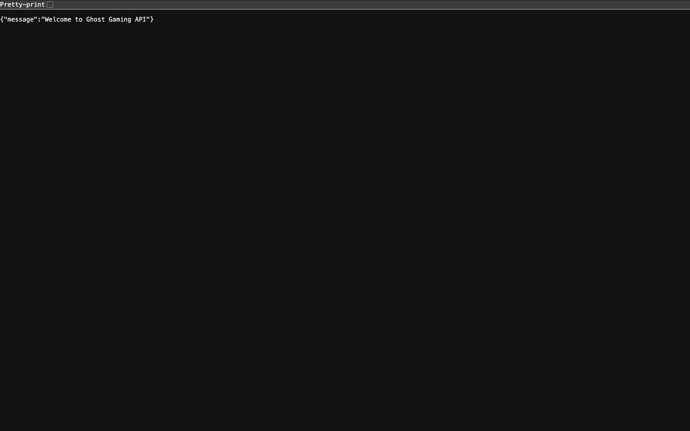

# Ghost Gaming Backend: Final Custom Project

This is the backend server, which focuses on a Ghost Gaming Platform built with **Express** and **MongoDB**. This serves as a proxy backend to resolve the CORS issue in order to fetch game data from the IGDB API.

## Table of Contents

- [Project Description](#project-description)
- [Project Features](#project-features)
- [Technologies Used](#technologies-used)
- [Plan for Improving the Project](#plan-for-improving-the-project)
- [Screenshots](#screenshots)
- [Live Demo](#live-demo)
- [Deployment Instructions](#deployment-instructions)
- [System Requirements](#system-requirements)

## Project Description

This is the backend for Ghost Gaming in order to work seamlessly with the Ghost Gaming Frontend. It provides a RESTful API for managing:

- Validation, error responses
- Securely fetching game data from the IGDB API
- User authentication

## Project Features

- Express: Web framework for implementing APIs
- Node.js: Server-side JS
- MongoDB: NoSQL database with Mongoose
- CORS: Cross-origin access for frontend integration
- Set up validation and custom error handling (middleware logic)
- bcrypt for password hashing
- Joi & Celebrate Validation
- dotenv: Environmental variable management

## Plan for improving the project

- Fix mobile view by using more media queries to enhance the styling to be more dynamic across devices.
- Fix limited user functionality to add to the "coming soon" feature to achieve the ability for users to save games to their profile collection.
- Fix limited security by using a helmet to achieve stronger security against vulnerabilities.

## Screenshots

- ## Deployment Site



## Live Demo

- Frontend + Backend: https://ghost-app.jumpingcrab.com/
- API Base URL: https://api.ghost-app.jumpingcrab.com/

## Deployment Instructions

- To run the backend locally:

1. Clone the repository:

 ```bash
   git clone https://github.com/samjamhas10/ghost-gaming-backend.git
 ```

2. Navigate to project directory:

   `cd ghost-gaming-backend`

3. Install dependencies

   `npm install`

## System Requirements

- Node.js: v23.11.0 or higher
- npm: v10.9.2 or higher
- Postman or similar API testing
- Modern web browser (Chrome, Firefox, Safari)
